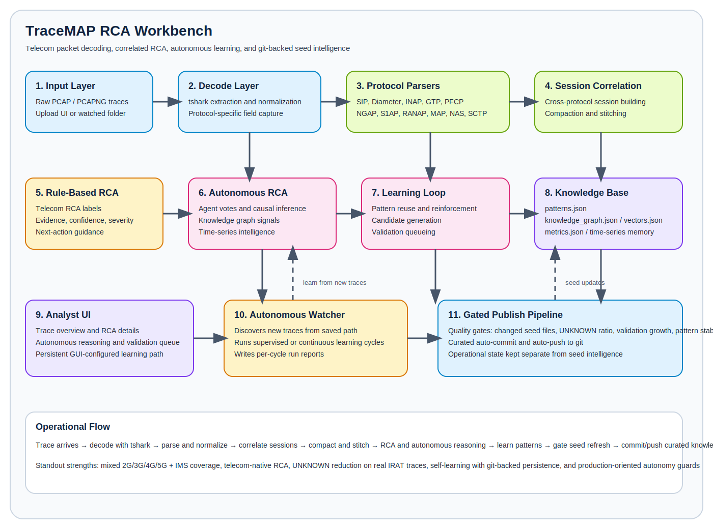

# TraceMAP-RCA-Workbench

TraceMAP RCA Workbench is a telecom packet-analysis and root-cause-analysis workbench for mixed 2G/3G/4G/5G and IMS traces. It combines protocol parsing, session correlation, rule-based RCA, learning/knowledge reuse, and a lightweight web UI for inspecting captures and correlated sessions.

## Tool Summary

TraceMAP RCA Workbench ingests telecom PCAPs, decodes signaling and user-plane protocols, correlates multi-protocol procedures into sessions, applies telecom RCA logic, overlays autonomous reasoning, and persists learned seed knowledge for future traces.

It is designed to improve continuously:

- baseline seed knowledge ships with the repo
- the autonomous watcher can discover new traces
- gated learning updates can refresh the knowledge base
- curated seed updates can auto-commit and auto-push to git

### Architecture And Flow



### Standout Capabilities

- Mixed telecom coverage across `2G`, `3G`, `4G/LTE`, `5G`, and `IMS`
- Cross-protocol RCA over `SIP`, `Diameter`, `INAP`, `NGAP`, `S1AP`, `RANAP`, `MAP`, `NAS_EPS`, `NAS_5GS`, `GTP`, `PFCP`, `TCP`, `UDP`, and `SCTP`
- Session compaction and stitching for fragmented mobility and inter-RAT procedures
- Hybrid RCA that combines deterministic rules with autonomous reasoning signals
- Persistent seed knowledge with knowledge graph, vectors, metrics, and time-series memory
- Autonomous watcher with gated seed refresh and git-backed publishing
- Analyst UI with validation queue, autonomous reasoning view, and configurable learning path

### Demo Materials

- Detailed presenter script: [`/Users/shivendraraj/Downloads/Tool-2/docs/demo/tracemap_demo_script.md`](/Users/shivendraraj/Downloads/Tool-2/docs/demo/tracemap_demo_script.md)
- Word-openable handout: [`/Users/shivendraraj/Downloads/Tool-2/docs/demo/TraceMAP_Demo_Script.rtf`](/Users/shivendraraj/Downloads/Tool-2/docs/demo/TraceMAP_Demo_Script.rtf)
- Gemini diagram prompt pack: [`/Users/shivendraraj/Downloads/Tool-2/docs/demo/gemini_diagram_prompts.md`](/Users/shivendraraj/Downloads/Tool-2/docs/demo/gemini_diagram_prompts.md)

## Quick Start

macOS or Linux:

```bash
git clone https://github.com/rajshivendra2026/TraceMAP-RCA-Workbench.git
cd TraceMAP-RCA-Workbench
python3.11 -m venv .venv
source .venv/bin/activate
python -m pip install --upgrade pip
pip install -r requirements.txt
python main.py
```

Windows PowerShell:

```powershell
git clone https://github.com/rajshivendra2026/TraceMAP-RCA-Workbench.git
cd TraceMAP-RCA-Workbench
py -3.11 -m venv .venv
.\.venv\Scripts\Activate.ps1
python -m pip install --upgrade pip
pip install -r requirements.txt
python main.py
```

Windows Command Prompt (`cmd.exe`):

```cmd
git clone https://github.com/rajshivendra2026/TraceMAP-RCA-Workbench.git
cd TraceMAP-RCA-Workbench
py -3.11 -m venv .venv
call .venv\Scripts\activate.bat
python -m pip install --upgrade pip
pip install -r requirements.txt
python main.py
```

Open:

```text
http://localhost:5050
```

## Repository Layout

- [`/Users/shivendraraj/Downloads/Tool-2/src`](/Users/shivendraraj/Downloads/Tool-2/src) contains the core parsing, correlation, RCA, ML, and autonomous-analysis code.
- [`/Users/shivendraraj/Downloads/Tool-2/src/app`](/Users/shivendraraj/Downloads/Tool-2/src/app) contains the Flask app factory, summary helpers, and server-side runtime state helpers.
- [`/Users/shivendraraj/Downloads/Tool-2/tests`](/Users/shivendraraj/Downloads/Tool-2/tests) contains the regression and contract test suite.
- [`/Users/shivendraraj/Downloads/Tool-2/docs`](/Users/shivendraraj/Downloads/Tool-2/docs) contains architecture and runbook notes.
- [`/Users/shivendraraj/Downloads/Tool-2/data`](/Users/shivendraraj/Downloads/Tool-2/data) contains runtime inputs plus selected seed knowledge artifacts.

## Running Locally

Use the local virtual environment if present:

```bash
python main.py
```

Run targeted tests with:

```bash
python -m pytest -q
```

Run the autonomous watcher once:

```bash
python -m src.autonomous.watcher --once
```

Run the autonomous watcher continuously:

```bash
python -m src.autonomous.watcher --interval 60
```

Serve the app with Waitress instead of the compatibility launcher:

```bash
waitress-serve --host=0.0.0.0 --port=5050 wsgi:app
```

## Important Commands

Install dependencies:

```bash
pip install -r requirements.txt
```

Run the web UI:

```bash
python main.py
```

Run the full test suite:

```bash
python -m pytest -q
```

Run focused autonomy tests:

```bash
python -m pytest tests/test_autonomous_watcher.py -q
```

Run one supervised learning cycle:

```bash
python -m src.autonomous.watcher --once
```

Run continuous autonomous learning:

```bash
python -m src.autonomous.watcher --interval 60
```

Trigger a manual git sync after local work:

```bash
git add .
git commit -m "Describe your change"
git push origin main
```

## Windows Setup

Recommended baseline:

- Windows 11
- Python `3.11`
- Git for Windows
- Wireshark with `tshark`

After installing Wireshark, confirm `tshark.exe` exists at:

```text
C:\Program Files\Wireshark\tshark.exe
```

If auto-detection does not pick it up, set the environment variable in PowerShell before running the app:

```powershell
$env:TC_RCA__TSHARK__BINARY="C:\Program Files\Wireshark\tshark.exe"
```

To avoid Matplotlib cache warnings on locked-down Windows profiles, set:

```powershell
$env:MPLCONFIGDIR="$PWD\.cache\matplotlib"
```

Then run:

```powershell
py -3.11 -m venv .venv
.\.venv\Scripts\Activate.ps1
python -m pip install --upgrade pip
pip install -r requirements.txt
python main.py
```

Windows `cmd.exe` equivalent:

```cmd
py -3.11 -m venv .venv
call .venv\Scripts\activate.bat
python -m pip install --upgrade pip
pip install -r requirements.txt
set TC_RCA__TSHARK__BINARY=C:\Program Files\Wireshark\tshark.exe
set MPLCONFIGDIR=%cd%\.cache\matplotlib
python main.py
```

If you want those environment variables every time in `cmd.exe`, run:

```cmd
setx TC_RCA__TSHARK__BINARY "C:\Program Files\Wireshark\tshark.exe"
setx MPLCONFIGDIR "%cd%\.cache\matplotlib"
```

Then close and reopen Command Prompt.

## Configure a New Machine From Git

1. Clone the repository.
2. Create and activate a Python `3.11` virtual environment.
3. Install dependencies from [`/Users/shivendraraj/Downloads/Tool-2/requirements.txt`](/Users/shivendraraj/Downloads/Tool-2/requirements.txt).
4. Install Wireshark or `tshark`.
5. Start the app with `python main.py`.
6. Run `python -m src.autonomous.watcher --once` to validate the learning path.

Suggested first-run sequence on a new machine:

```bash
git clone https://github.com/rajshivendra2026/TraceMAP-RCA-Workbench.git
cd TraceMAP-RCA-Workbench
python -m venv .venv
source .venv/bin/activate
pip install -r requirements.txt
python -m pytest tests/test_autonomous_watcher.py -q
python main.py
```

Suggested first-run sequence on Windows PowerShell:

```powershell
git clone https://github.com/rajshivendra2026/TraceMAP-RCA-Workbench.git
cd TraceMAP-RCA-Workbench
py -3.11 -m venv .venv
.\.venv\Scripts\Activate.ps1
pip install -r requirements.txt
python -m pytest tests/test_autonomous_watcher.py -q
python main.py
```

Suggested first-run sequence on Windows `cmd.exe`:

```cmd
git clone https://github.com/rajshivendra2026/TraceMAP-RCA-Workbench.git
cd TraceMAP-RCA-Workbench
py -3.11 -m venv .venv
call .venv\Scripts\activate.bat
python -m pip install --upgrade pip
pip install -r requirements.txt
set TC_RCA__TSHARK__BINARY=C:\Program Files\Wireshark\tshark.exe
set MPLCONFIGDIR=%cd%\.cache\matplotlib
python -m pytest tests/test_autonomous_watcher.py -q
python main.py
```

If you want the new machine to treat all local traces as unseen, clear the watcher state before starting autonomous learning:

```bash
rm -f data/knowledge_base/processed_sources.json
```

Windows PowerShell equivalent:

```powershell
Remove-Item data\knowledge_base\processed_sources.json -ErrorAction SilentlyContinue
```

Windows `cmd.exe` equivalent:

```cmd
del data\knowledge_base\processed_sources.json
```

If you also want a clean analyst-review queue on the new machine, optionally clear:

```bash
rm -f data/knowledge_base/validation_queue.json
rm -rf data/knowledge_base/run_reports
```

Windows PowerShell equivalent:

```powershell
Remove-Item data\knowledge_base\validation_queue.json -ErrorAction SilentlyContinue
Remove-Item data\knowledge_base\run_reports -Recurse -Force -ErrorAction SilentlyContinue
```

Windows `cmd.exe` equivalent:

```cmd
del data\knowledge_base\validation_queue.json
rmdir /s /q data\knowledge_base\run_reports
```

### Windows CMD Commands You Will Actually Use

Set environment for the current shell:

```cmd
set TC_RCA__TSHARK__BINARY=C:\Program Files\Wireshark\tshark.exe
set MPLCONFIGDIR=%cd%\.cache\matplotlib
```

Activate the virtual environment:

```cmd
call .venv\Scripts\activate.bat
```

Run focused autonomy tests:

```cmd
python -m pytest tests/test_autonomous_watcher.py tests/test_learning_path_settings.py -q
```

Run the full test suite:

```cmd
python -m pytest -q
```

Run one supervised watcher cycle:

```cmd
python -m src.autonomous.watcher --once
```

Run the watcher continuously:

```cmd
python -m src.autonomous.watcher --interval 60
```

Run the web app:

```cmd
python main.py
```

## Docker

The app can run in Docker, including the `tshark` dependency used for PCAP decoding.

Build and start it with:

```bash
docker compose up --build
```

Then open:

```text
http://localhost:5050
```

Container details:

- [`/Users/shivendraraj/Downloads/Tool-2/Dockerfile`](/Users/shivendraraj/Downloads/Tool-2/Dockerfile) installs Python dependencies and `tshark`, then serves the app with `waitress`.
- [`/Users/shivendraraj/Downloads/Tool-2/docker-compose.yml`](/Users/shivendraraj/Downloads/Tool-2/docker-compose.yml) maps port `5050` and mounts runtime directories for uploaded PCAPs, parsed outputs, features, models, and logs.
- `data/knowledge_base/` stays baked into the image as tracked seed data.

Notes:

- Uploaded or learned runtime outputs under `data/raw_pcaps/`, `data/parsed/`, `data/features/`, `data/models/`, and `logs/` are mounted from the host in `docker-compose.yml`.
- If you want completely ephemeral container runs, remove those volume mounts.
- The container sets `TC_RCA__TSHARK__BINARY=/usr/bin/tshark` so the app does not rely on host Wireshark paths.

## Remote Access

There are four supported remote-access paths documented in [`/Users/shivendraraj/Downloads/Tool-2/docs/remote_access.md`](/Users/shivendraraj/Downloads/Tool-2/docs/remote_access.md):

1. Tailscale for private access from anywhere
2. Cloudflare Tunnel for public HTTPS without opening ports
3. Caddy for HTTPS reverse proxy on a server or VM
4. [`/Users/shivendraraj/Downloads/Tool-2/docker-compose.prod.yml`](/Users/shivendraraj/Downloads/Tool-2/docker-compose.prod.yml) as the production deployment baseline

## Seed Knowledge Base

The files under [`/Users/shivendraraj/Downloads/Tool-2/data/knowledge_base`](/Users/shivendraraj/Downloads/Tool-2/data/knowledge_base) are intentionally tracked as seed data.

These files provide a starting knowledge layer for the RCA engine and learning flows, including:

- `knowledge_graph.json`
- `metrics.json`
- `patterns.json`
- `timeseries_intelligence.json`
- `vectors.json`

They are kept in git so a fresh clone starts with baseline RCA memory and supporting metadata rather than an empty knowledge store.

The following knowledge-base files are operational state and may be reset per machine if you want a clean local intake history:

- `processed_sources.json`
- `validation_queue.json`
- `run_reports/`

## Ignored Generated Data

The following are treated as local/generated runtime output and are ignored by git:

- `data/raw_pcaps/`
- `data/parsed/`
- `data/features/`
- `data/models/`
- `logs/`
- local virtual environment folders and cache artifacts
