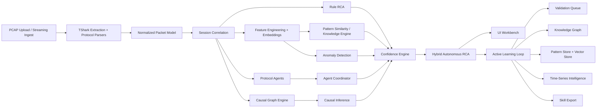

# Autonomous RCA Intelligence Architecture

## Key Design Outcomes

- Rule-based RCA remains the explainable backbone.
- Protocol agents add specialist hypotheses without breaking the shared RCA contract.
- Causal inference adds chain reasoning beyond direct pattern matching.
- Confidence is calibrated from multiple transparent sources.
- Knowledge evolves into both reusable patterns and a structured graph.
- Time-series intelligence helps distinguish transient and recurring failures.
- The same autonomous stack supports batch and real-time processing.
