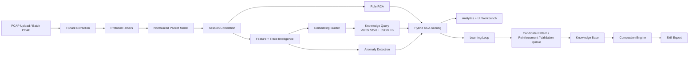

# Self-Learning RCA Intelligence Architecture

## What We Added

- `src/intelligence/knowledge_engine.py`
  Persistent pattern store with context-aware retrieval.
- `src/intelligence/vector_store.py`
  FAISS-compatible similarity search with pure-Python fallback.
- `src/intelligence/learning_loop.py`
  Controlled reinforce-or-candidate learning flow after RCA.
- `src/intelligence/compaction_engine.py`
  Pattern merge, decay, stale cleanup, and knowledge size control.
- `src/intelligence/skill_exporter.py`
  Portable high-confidence pattern export for cold-start reduction.
- `src/intelligence/llm_explainer.py`
  Human-readable RCA narrative generation from hybrid decisions.

## Hybrid RCA Logic

Final RCA is computed as a weighted combination of:

- rule confidence
- historical pattern similarity
- anomaly signal strength

Rules remain the primary source of truth, while learned patterns and anomaly evidence adjust confidence and help resolve repeated cross-protocol scenarios.

## Deployment Modes

- Real-time mode:
  Upload path executes hybrid RCA and lightweight learning without blocking the main analyst workflow.
- Batch mode:
  Pipeline processing can compact knowledge and export skill files after larger offline runs.

## Stored Artifacts

- `data/knowledge_base/patterns.json`
- `data/knowledge_base/vectors.json`
- `data/knowledge_base/validation_queue.json`
- `data/skill_files/latest.json`
